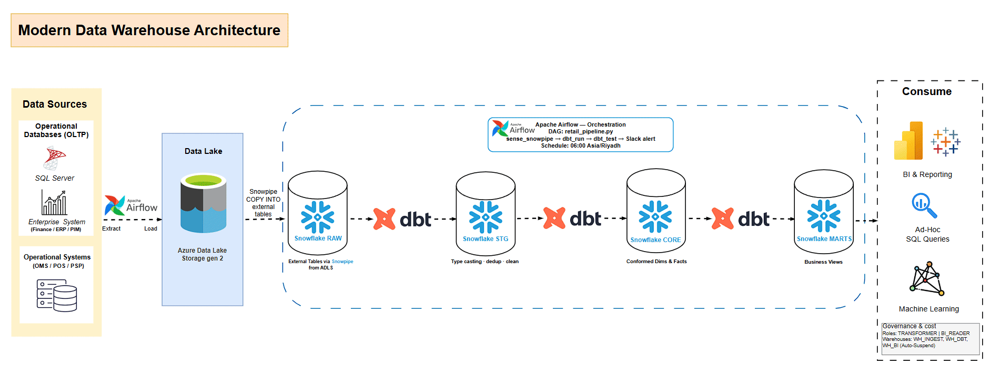

# modern-data-warehouse-snowflake-dbt-airflow
## 🏗️ High-Level Architecture


# GulfMart Modern Data Warehouse (Snowflake + dbt + Airflow)

End-to-end analytics engineering project for GulfMart retail:
- **Sources**: OMS, CRM, PIM, PSP, Finance, FX, VAT
- **Warehouse**: Snowflake
- **Transformations**: dbt
- **Orchestration**: Airflow
- **CI**: GitHub Actions

---

## Architecture

1. **Raw Layer**: `raw.*` Snowflake schemas populated from CSV / ingestion.
2. **Staging Layer (`stg_`)**:
   - One model per source table (e.g. `stg_orders`, `stg_order_items`, `stg_customers`).
   - Standardized types, codes, timestamps, booleans.
3. **Core Layer (`dim_` / `fact_`)**:
   - SCD2 dimensions: `dim_customer`, `dim_store`, `dim_product`.
   - Static dimensions: `dim_date`, `dim_currency`, `dim_channel`, `dim_payment`.
   - Transactional facts: `fact_order`, `fact_order_line`.
4. **Marts (`mart_`)**:
   - `mart_monthly_orders_by_store`
   - `mart_net_sales_by_country_monthly`
   - `mart_channel_mix_monthly`
   - `mart_aov_monthly`
   - `mart_active_customers_monthly`
   - `mart_repeat_purchase_rate_monthly`
   - `mart_refund_rate_amount_monthly`
   - `mart_store_target_vs_actual_monthly`
   - `mart_store_performance_index`

---

## How to run dbt

From the project root:

```bash
# Install dependencies
pip install -r requirements.txt

# Install dbt packages
dbt deps

# Compile & run
dbt run
dbt test

# Only marts
dbt run -s models/marts/*
dbt test -s models/marts/*
