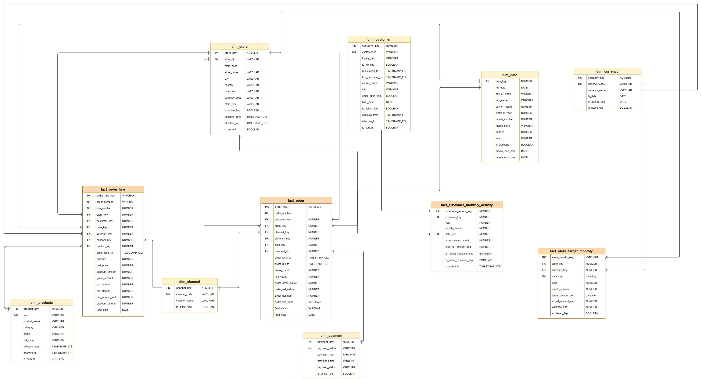

# GulfMart Modern Data Warehouse (Snowflake + dbt + Airflow)

End-to-end analytics stack for a fictional retailer **GulfMart**:

- Raw OMS / CRM / PIM / Finance CSVs → Snowflake RAW
- Transform with **dbt** into staging, **core dims/facts**, and **marts**
- Orchestrate daily runs with **Airflow**
- Production-minded **ops, SLOs, cost, contracts & CI**

---

## 1. Architecture


---

## 2. Data Model (Facts & Dimensions)



**Core facts**

- `CORE.fact_order_line` – one row per **order_number × line_number**
- `CORE.fact_order` – one row per **order_number**
- `CORE.fact_customer_monthly_activity` – one row per **customer × month**
- `CORE.fact_store_target_monthly` – one row per **store × month**

**Conformed dimensions**

- `CORE.dim_date`, `CORE.dim_store`, `CORE.dim_customer`
- `CORE.dim_product`, `CORE.dim_channel`, `CORE.dim_currency`, `CORE.dim_payment`

---

## 3. Repository Layout

```text
.
├── 00_overview/
│   ├── architecture_diagram.gif
│   ├── business_context.md
│   ├── repo_map.md
│   └── README.md
├── 01_data_lake/
│   └── README.md
├── 02_business/
│   ├── business_processes/
│   └── qnf/
├── 03_design/
│   ├── grain_cards/
│   ├── s2t_mapping/
│   └── star_schemas/
├── 04_snowflake/
│   ├── 01_create_warehouse.sql
│   ├── 02_create_db_schema.sql
│   ├── 03_storage_integraton.sql
│   ├── 04_create_stages.sql
│   ├── 05_create_raw_tables.sql
│   └── 06_copy_into_raw.sql
├── 05_dbt_project/
│   ├── models/
│   │   ├── stg/
│   │   ├── core/
│   │   │   ├── dim/
│   │   │   └── facts/
│   │   └── marts/
│   ├── snapshots/
│   ├── seeds/
│   └── tests/
├── 06_airflow/
│   ├── dags/
│   │   └── retail_pipeline.py
│   └── README.md
├── 07_bi/
│   └── README.md
├── 08_ops/
│   ├── alerts/
│   ├── checks/
│   ├── cost/
│   ├── data_contracts/
│   ├── lineage/
│   ├── monitors/
│   ├── runbooks/
│   └── slo/
├── 09_ci_cd/
│   └── README.md
├── 10_docs/
│   └── README.md
├── .github/
│   └── workflows/
│       └── dbt_ci.yml
└── README.md
